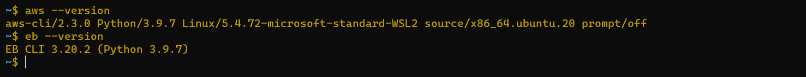

# cloud-server

- Simple API server with two end points : `/`, `/index.html`.

---

## AWS & EB installed versions

---

## Links

[Pull request](https://github.com/Wesam-Alqawasmeh/cloud-server/pull/1)

[Deployed on Heroku](https://wesam-cloud-server.herokuapp.com/)
